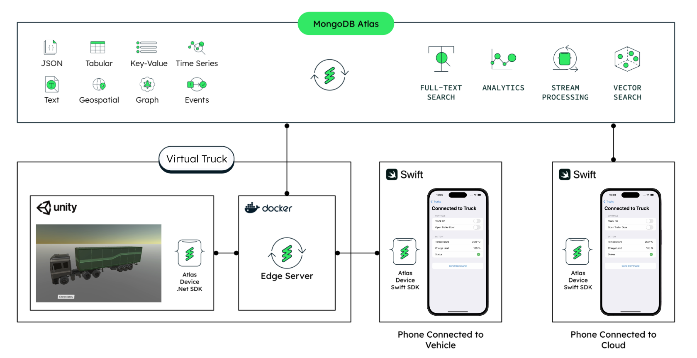
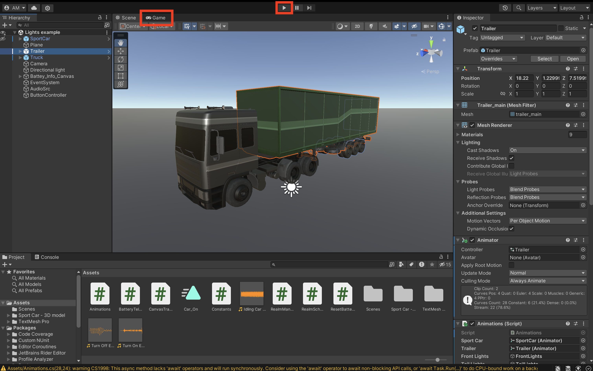

# Connected Vehicle with Edge Server
The automotive and transportation industries are going through a significant transformation.

This transformation is the shift to software-focused vehicles. This is known as **Software Defined Vehicles**. 

Thanks to being able to reliably ship new updates to software on the vehicles, this transformation will enable innovative customer experiences, increase security, make more efficient transportation and open new business models. 

However, creating a state-of-the-art connected vehicle platform requires a high quality foundation.
In this demonstration, we will showcase a connected vehicle utilizing MongoDB Edge Server, the Atlas Device SDKs (previously known as Realm), and Device Sync. 

MongoDB and its Device SDKs serve as a comprehensive data layer, facilitating effective two-way data transfer and maintaining consistency across ECUs, DCUs, HCPs, mobile devices, and cloud systems. Allowing you to focus on value-generating work such as enhancing the driving experience, gaining value out of the data or produce the right recommendations.


In this Repository we will walk you through how to set up this connected vehicle demo following the architecture below:




# Set up instructions
<br>

# Part 1 - MongoDB Atlas Backend

In order to the make the demo work end-to-end, you will need to set up the backend. Let's get started! 

## Setup the MongoDB Atlas Backend

1. Go to [MongoDB Cloud](https://cloud.mongodb.com/) and create user account.
2. Under the Data Services tab, click "Database" in the sidebar, then "+ Create" and [create a new MongoDB cluster](https://www.mongodb.com/docs/atlas/tutorial/create-new-cluster/) in your preferred region and call it ```Connected-Vehicle-DB```. <br>You can choose a Free, Serverless, or Dedicated cluster.
3. Go through the access configuration setup depending on your needs. Usually defaults are fine. 

## Setup App Services and create an App
You can also follow the instructions on [this page](https://www.mongodb.com/docs/atlas/app-services/apps/create/#create-an-app-services-app) and create an app from the template 'Real-time Sync'. However, here are also the steps to follow:
1. [Install the App Services CLI](https://www.mongodb.com/docs/atlas/app-services/cli/#installation). This will allow you to manage your Applications through the terminal. 
2. [Generate API key](https://www.mongodb.com/docs/atlas/app-services/cli/#generate-an-api-key), assign the `Project Owner` permission and add your IP address to the access list
3. [Login with your API key](https://www.mongodb.com/docs/atlas/app-services/cli/#authenticate-with-an-api-key)

4. In the terminal, navigate to `/atlas_backend` on this repository and import the Connected-Vehicle application with the command:

    `appservices push --local ./Connected-Vehicle-Edge-Server --remote Connected-Vehicle-Edge-Server` 

    You will be prompted to configure the app [options](https://www.mongodb.com/docs/atlas/app-services/cli/appservices-push/#appservices-push). Set them according your needs. If you are unsure which options to choose, the default ones are usually a good way to start! 

    4.a If you are building this app on an existing cluster that isn't named `Connected-Vehicle-DB`, you should go to `atlas_backend/Connected-Vehicle-Edge-Server/data_sources/mongodb-atlas/config.json` and edit the `clusterName` field such as `"clusterName": "<your-cluster-name>",`

    After you've chosen your options, you should see the following appear: 

        App created successfully
    
        ...
    
        Successfully pushed app up: Your App ID 
    
    Your App ID should be in the following format: YourAppName-XXXXX

5. Create the demo user by pasting the following into your command shell: `appservices users create --type email --email demo --password demopw`. Be sure to change the default password. You then have to provide the previously received App ID or just type the application name `Connected-Vehicle-Edge-Server`.

    You should see the following appear: 
        
        App ID or Name (here you'll insert your App ID) 
        Successfully created user
        {
            "id": , 
            "enabled": , 
            "email": ,
            "type":
        }
6. Run the following command: `appservices apps list` to check if your app has been created. 
    
    You should see the following appear: 
        
        Found 1 apps
        Client App ID                        Project ID                _id                     
        -----------------------------------  ------------------------  ------------------------
        your-app-id                          your-project-id           app-_id


7. Congrats! The first part is done. Now you'll continue with configuring Edge Server


# Part 2 - Edge Server

Edge Server is a local server that sits between your client devices and MongoDB Atlas App Services. 

## Get Access to Edge Server Private Preview

At the time of writing this documentation, Edge Server is in Private Preview. 

You can do this step and follow the rest of the instructions in the meantime. 

If you are a MongoDB customer, contact your Product or Account Representative to enable this step. 
1. Go to the [Atlas Edge Server](https://www.mongodb.com/products/platform/atlas-edge-server) page and Request Access to the Private Preview by filling the form. 

2. When contacted, you will have to give your [App Services App ID](https://www.mongodb.com/docs/atlas/app-services/apps/metadata/#std-label-find-app-id) to enable Edge Server and generate an authorization secret for your App.


## Install Edge Server

1. [Get Edge Server Code](https://www.mongodb.com/docs/atlas/app-services/edge-server/configure/#get-the-edge-server-code)
2. Once Edge Server folder is unzipped, open and edit the `config.json` file as follows:
    ```json
    {
    "clientAppId": "YOUR-APP-ID",
    "query": "*",
    "cloudSyncServerAuthSecret": "YOUR-AUTH-SECRET",
    "hostname": "localhost:80",
    "tls" : {
        "enabled": false,
        "certificates": [
        {
            "publicKeyPath": "certs/cert.pem",
            "privateKeyPath": "certs/certkey.pem"
        }
        ]
    }
    }
    ```
    - In `"clientAppId": "YOUR-APP-ID"` set your your [App Services App ID](https://www.mongodb.com/docs/atlas/app-services/apps/metadata/#std-label-find-app-id)
    - In `"cloudSyncServerAuthSecret": "YOUR-AUTH-SECRET"` set the auth token that you should have received in the previous step. If you don't have it yet, continue the tutorial and come back to edit this file later. This is the only place where you would need the secret.
    - In `"hostname": "localhost:80",`. We have set up local host 80. Feel free to pick any other host name.
3. [Install Edge Server Dependencies](https://www.mongodb.com/docs/atlas/app-services/edge-server/configure/#install-dependencies)


Congrats!! You have completed Step 2 of this demo. Go to step 3 to continue. 


# Part 3 - Set Up Unity

### Prerequisites

[Download Unity](https://unity.com/releases/editor/whats-new/2022.3.13), and make sure is version is 2022.3.13 or higher.

### Setup

> [!TIP]
> Make sure to do this step before opening the Unity project to avoid the Unity project opening in Safe mode. 
1. Open your terminal or command line interface and for to the Assets folder: `cd Unity Car/Assets`
2. Create a Unity Constants file named `Constants.cs` to store the constants used by the project. This includes, the App Services ID, as well as its username and password, and the baseURL for Edge Server. You can do this by running the following command:
    ```
    echo 'sealed class Constants
    {
        public sealed class Realm
        {
            public const string AppId = ">>YOUR-APP-ID<<";
            public const string baseURL = "http://localhost:80";
            public const string UserName = "demo";
            public const string Password = "demopw";
            public static bool flag = false;
        }
    }' > Constants.cs
    ```
    Make sure to edit the command to include your App ID. Also, you can set a different UserName and Password here if your App has different values. 

4. Open Unity Hub and then Add `Unity Car/` as a project.


Congrats!! You have completed Step 3 of this demo. Go to step 4 to continue. 

# Part 4 - Set Up the iOS Swift Apps

This project runs two iOS applications. One application will be connected directly to Edge Server and the other on will be connected to Atlas. These app are in the folders: `iOS-App-Edge-Server` and `iOS-App-Atlas`.


### iOS app connected to Edge Server

1. Open the project with Xcode by clicking the file: `iOS-App-Edge-Server/iOS-App-Edge-Server.xcodeproj`.
2. Open the config file  ```/iOS-App-Edge-Server/Config.xcconfig```
3. Update ```Atlas_App_ID = <-- Your Atlas App ID -->```
4. Run the the app. Sometimes it may be required to reset the package caches in Xcode -> ```'File -> Packages -> Reset Package Caches'```
5. If you have changed the password for the user created in [part 1](https://github.com/mongodb-industry-solutions/) update the password on the login screen!


Follow the exact same steps for the app connected to Atlas.
### iOS app connected to Atlas

1. Open the project with Xcode by clicking the file: `iOS-App-Atlas/iOS-App-Atlas.xcodeproj`.
2. Open the config file  ```/iOS-App-Atlas/Config.xcconfig```
3. Update ```Atlas_App_ID = <-- Your Atlas App ID -->```
4. Run the the app. Sometimes it may be required to reset the package caches in Xcode -> ```'File -> Packages -> Reset Package Caches'```
5. If you have changed the password for the user created in [part 1](https://github.com/mongodb-industry-solutions/) update the password on the login screen!


And that's all the setup required! 
# Run the demo

Make sure your cluster on the Cloud is up and running. 
1. In the terminal change directory to `/edge_server`, and run `make up`. This will start Edge Server in a few seconds. 
2. Open the Unity project, and click on the play button which is located on the top center of the UI. This will start the unity game.


3. Open the two Xcode projects: `iOS-App-Atlas/iOS-App-Atlas.xcodeproj` and `iOS-App-Edge-Server/iOS-App-Edge-Server.xcodeproj`.
4. Run the the apps. Sometimes it may be required to reset the package caches in Xcode -> ```'File -> Packages -> Reset Package Caches'```


Now you have everything up and running! 


